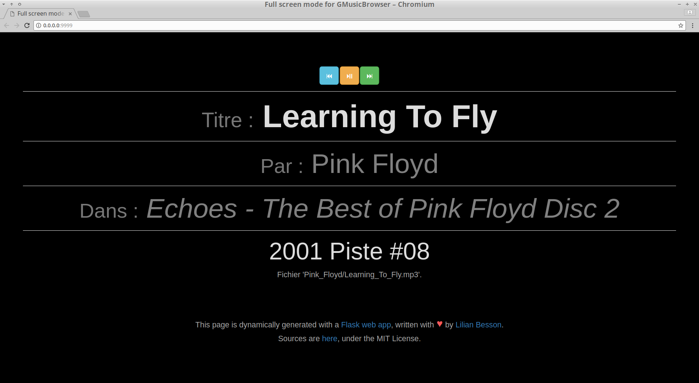
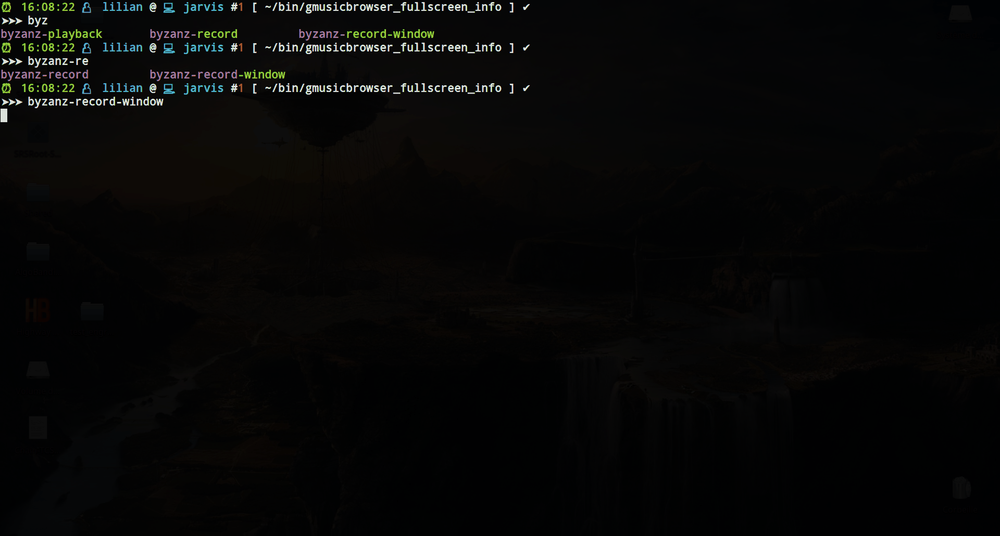
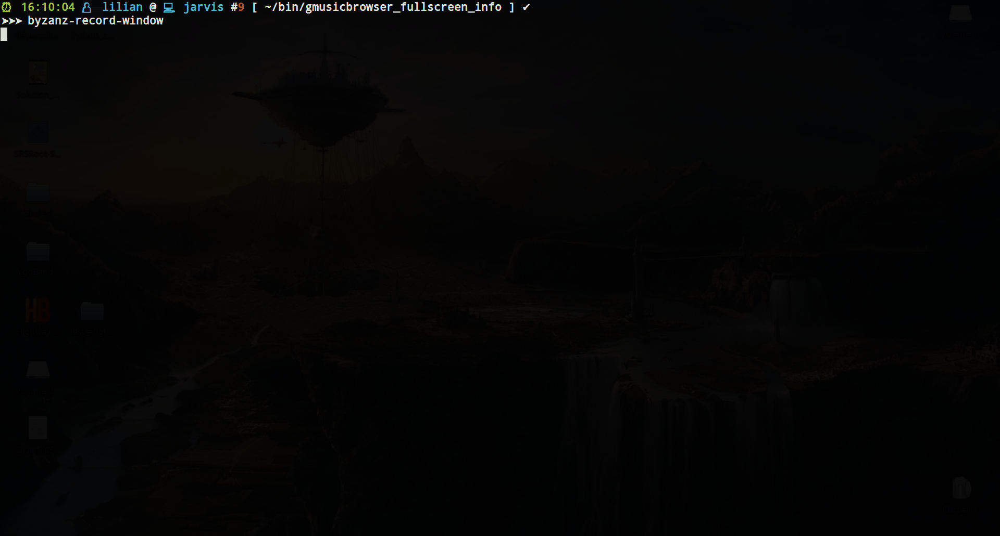

# Full Screen mode for [GMusicBrowser](http://gmusicbrowser.org/)

This program is a simple web app that connects to the GMusicBrowser API to display in white-on-black and very large font the current song played by my favorite music player.
It allows to change to the next and prev song.

## Why?

> When I host some friends, and use my laptop to play music, and I don't want my screen to show anything but the name of the song, and my friends should only be able to go to the next song, not read my email or whatever: putting this webpage in full screen helps!

> Also, it is displayed in very large font, to be easily readable from anywhere in the room.

## Screenshot



## How to install

- Install Python, version 3.10+, and `pip`,

- Previously: install requests and Flask modules with `pip`: `sudo pip3 install -U requests flask`, but now it works with a virtual environment, see [issue #2](https://github.com/Naereen/GMusicBrowser-FullScreen-WebApp/issues/2) and information below.

- Clone this project,
```bash
cd ~/publis/
git clone https://github.com/Naereen/GMusicBrowser-FullScreen-WebApp.git
```

- Save it somewhere, for instance `~/publis/GMusicBrowser-FullScreen-WebApp.git` (the path should be modified in some of the source files, if you save it somewhere else),

- Go in the folder, and do `make create-venv install-requirements` *once*, to create the virtual environment, and install the dependencies (`requests` and `flask`) in this `venv/` virtual environment.

- When you want to use the application, go in the folder, and do `make run`.

Note: you can also use [this .desktop file](gmusicbrowser-fullscreen-webapp.desktop) to install this as a desktop application:

```bash
$ desktop-file-validate gmusicbrowser-fullscreen-webapp.desktop
# if this is OK, install it
$ sudo desktop-file-install gmusicbrowser-fullscreen-webapp.desktop
```

Then the application will be available from your desktop menu, under the name "Full screen mode for GMusicBrowser".

## Settings

In GMusicBrowser settings, under the tab "Plugins", enable the "Current song" plugin,
and use these two values for the two text boxes:

- Command to run when the song starts:
  `/home/lilian/publis/GMusicBrowser-FullScreen-WebApp.git/update_ui.py start %t %a %l %y %d %n %f %c`

- Command to run when the song stops:
  `/home/lilian/publis/GMusicBrowser-FullScreen-WebApp.git/update_ui.py stop %t %a %l %y %d %n %f %c`

**Of course, you have to adapt the path** to where you downloaded and saved this project folder (`gmusicbrowser_fullscreen_info`).
Change the `/home/lilian/publis/` part to where you downloaded this project!

## Interactive demo

This short (15s) video shows how to do that:



## How to use

- Launching the app also opens it in Chromium (by default).
- Use 'n' to play next song, 'p' for previous song, 'space' to pause, 'u' and 'd' to increase and decrease volume (needs [this script](Volume.sh) somewhere in your PATH).

> This is a **very minimalist** interface to GMusicBrowser, any other manipulation still have to be done from the main GMusicBrowser interface, of course!

## Interactive demo

This other video (30s) shows how to do that:



> It shows a nice "fireworks" effects that appears on the page for each click and each action (either a click on a button or a shortcut).
> It is coded [with this script](static/js/fireworks.js), which uses the [awesome `anime.js`](http://animejs.com/) project by [@juliangarnier](https://github.com/juliangarnier/) ([see on GitHub](https://github.com/juliangarnier/anime)), but I disabled it as I was tired of it.
> You can enable it again by uncommenting the lines 198-200 on the template file: [`template.html`](template.html).

----

## :scroll: License ? [](https://github.com/Naereen/GMusicBrowser-FullScreen-WebApp/blob/master/LICENSE)

[MIT Licensed](https://lbesson.mit-license.org/) (file [LICENSE](LICENSE)).
© [Lilian Besson](https://GitHub.com/Naereen), 2018-2025.

I wrote this app on my birthday in 2018, as a challenge and as a "tech gift for my future self". I like it a lot!

[](https://GitHub.com/Naereen/GMusicBrowser-FullScreen-WebApp/graphs/commit-activity)
[](https://GitHub.com/Naereen/ama)
[](https://www.python.org/)
[](https://www.gnu.org/software/bash/)

[](https://GitHub.com/Naereen/)
[](http://ForTheBadge.com)
[](https://GitHub.com/)
[](http://ForTheBadge.com)
[](http://ForTheBadge.com)
[](http://ForTheBadge.com)
